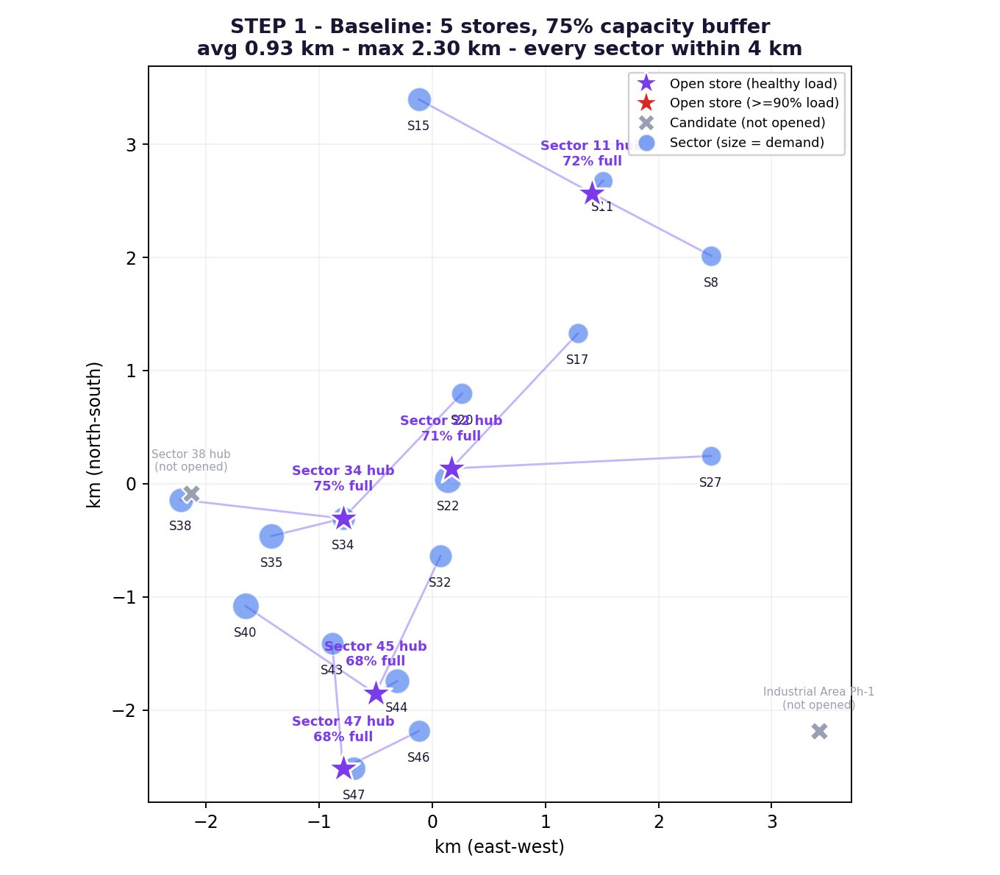
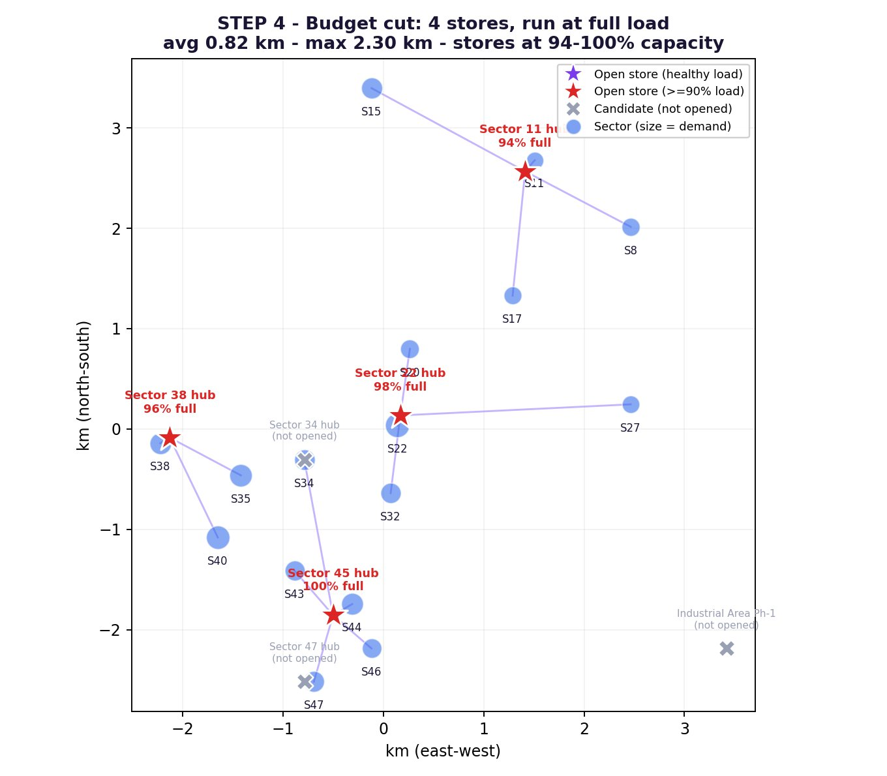
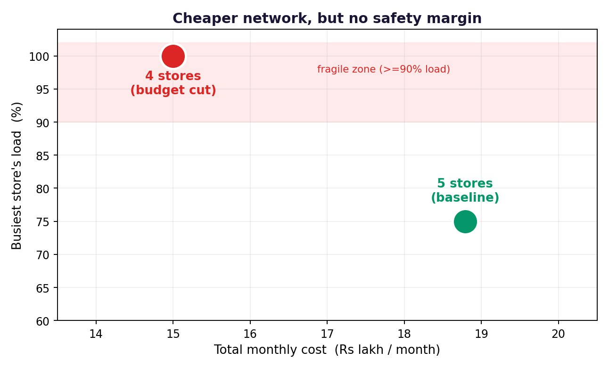

# Where Should Zepto Open Its Dark Stores in Chandigarh?

A capacitated facility-location model (integer programming) that decides **which dark stores Zepto should open in Chandigarh** to serve all sectors within a 10-minute delivery promise — and what happens when finance cuts the budget from 5 stores to 4.


---

## TL;DR

| Metric                | Baseline (5 stores) | Budget cut (4 stores) |
|-----------------------|---------------------|------------------------|
| Total cost / month    | ₹18.8 lakh          | ₹15.0 lakh (**−20%**)  |
| Avg delivery distance | 0.93 km             | 0.82 km                |
| Worst-case distance   | 2.30 km             | 2.30 km                |
| Busiest store load    | 75% (safe)          | **100% (fragile)**     |

The budget cut saves ~₹45 L/year, but the network operates with **zero safety margin** — a quantified trade-off the manager can act on.

---

## Problem

Zepto enters Chandigarh with 16 demand sectors (~63,100 orders/month) and 7 candidate dark-store sites. Each store has a fixed monthly cost (rent + staff) and a capacity. Goal: minimise **total monthly cost = fixed cost + delivery cost**, subject to:

1. Every sector served exactly once
2. A sector can only be served by an opened store
3. Store capacity (with a 75% safety buffer in the baseline)
4. 4 km maximum delivery radius (10-minute promise)
5. *(Challenge)* Open at most 4 stores

Distances are **real great-circle (haversine) distances** computed from real Chandigarh sector GPS coordinates. Demand and cost numbers are realistic but synthetic.

## The Model

Mixed-integer linear program solved with **PuLP + CBC**:

```
minimise   Σⱼ fⱼ·yⱼ  +  Σᵢⱼ (Pᵢ · dᵢⱼ · c / 10) · xᵢⱼ

s.t.       Σⱼ xᵢⱼ = 1                    ∀ i
           xᵢⱼ ≤ yⱼ                       ∀ i, j
           Σᵢ Pᵢ·xᵢⱼ ≤ u · Cⱼ · yⱼ        ∀ j
           xᵢⱼ = 0 if dᵢⱼ > 4 km
           Σⱼ yⱼ ≤ B                      (optional budget cap)
           yⱼ, xᵢⱼ ∈ {0,1}
```

## Results

### Baseline — 5 stores, 75% safety buffer


### Budget cut — 4 stores, run at full capacity


### The trade-off


---

## Reproducing the results

```bash
git clone https://github.com/Shubham-Kumar06/zepto-chandigarh-darkstores.git
cd zepto-chandigarh-darkstores
pip install -r requirements.txt

# Reproduces every number in the report
python src/run_all.py

# Regenerates all three figures
python src/make_figures.py
```

Every number in the final report is printed by `run_all.py` — nothing is hand-typed.

## Repository structure

```
├── src/
│   ├── chandigarh_data.py        # sectors, candidate sites, parameters
│   ├── dark_store_optimization.py # the IP model
│   ├── make_figures.py            # produces the three PNG figures
│   └── run_all.py                 # reproduces every reported number
├── figures/                       # generated maps and trade-off chart
├── requirements.txt
└── README.md
```

## Tech stack

- **Python 3.10+**
- [PuLP](https://github.com/coin-or/pulp) — modelling layer
- [CBC](https://github.com/coin-or/Cbc) — open-source MILP solver (ships with PuLP)
- Matplotlib — visualisation

## What I learned

- Translating fuzzy business rules ("open only 4 stores", "deliver in 10 min") into hard mathematical constraints.
- That a *binding* budget constraint can make a problem infeasible — the fix often lies in relaxing a different constraint (the safety buffer), not the budget itself.
- How to communicate a managerial trade-off (₹3.8 L savings vs. zero capacity headroom) using one chart instead of a spreadsheet.

## Possible extensions

- Predict-then-optimise: estimate Pᵢ from zip-code features via regression, then feed into the IP.
- Robust optimisation under optimistic / expected / pessimistic demand scenarios.
- Multi-period expansion: when to phase in the 5th store as revenue grows.
- Equity objective: minimax distance so no sector is sacrificed.


## License

MIT — see [LICENSE](LICENSE).
